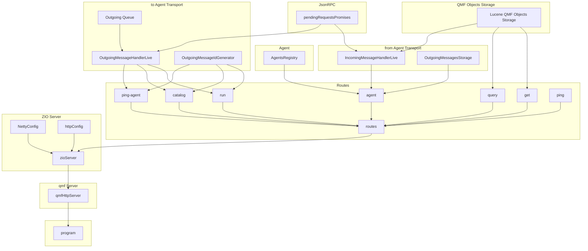

## QMF PoC Service

### Build & run

```
sbt assemby
java -jar target/scala-3.6.4/service-assembly-0.1.0-SNAPSHOT.jar
```

builds fat jar: target/scala-3.6.4/service-assembly-0.1.0-SNAPSHOT.jar


### Components

